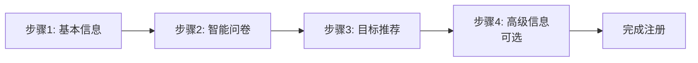

# Zenify 技术文档

> 智能健康饮食管理应用技术文档  
> 版本: 1.0.0  
> 更新日期: 2025-01-15

---

## 目录

- [项目概述](#项目概述)
- [技术栈](#技术栈)
- [架构设计](#架构设计)
- [核心功能](#核心功能)
- [数据模型](#数据模型)
- [API接口](#api接口)
- [服务层详解](#服务层详解)
- [路由系统](#路由系统)
- [状态管理](#状态管理)
- [实时通信](#实时通信)
- [安全与认证](#安全与认证)
- [开发指南](#开发指南)
- [部署说明](#部署说明)

---

## 项目概述

### 项目简介

**Zenify** 是一个基于 Flutter 开发的跨平台智能健康饮食管理应用，集成了 AI 营养分析、图像识别、实时通信、语音交互等先进技术，为用户提供个性化的饮食建议和健康管理服务。

### 核心特性

- ✨ **智能注册系统**：基于年龄性别的自适应问卷
- 🤖 **AI 营养分析**：实时饮食健康度评估
- 📸 **图像识别**：拍照识别食物成分
- 💬 **智能对话**：多模态 AI 营养顾问
- 📊 **健康报告**：可视化营养数据分析
- 🔄 **实时同步**：MQTT 实时状态推送
- 🎤 **语音交互**：语音输入识别
- 📱 **跨平台**：支持 iOS、Android、Web、桌面端

### 应用架构图

```
┌─────────────────────────────────────────────────────────────┐
│                      Flutter 应用层                          │
│  ┌──────────┐ ┌──────────┐ ┌──────────┐ ┌──────────┐      │
│  │  注册流程 │ │   主页   │ │ AI 聊天  │ │ 健康报告 │      │
│  └──────────┘ └──────────┘ └──────────┘ └──────────┘      │
│  ┌──────────┐ ┌──────────┐ ┌──────────┐ ┌──────────┐      │
│  │   相机   │ │  个人中心│ │  菜单    │ │ 设备管理 │      │
│  └──────────┘ └──────────┘ └──────────┘ └──────────┘      │
└─────────────────────────────────────────────────────────────┘
                              │
                              ▼
┌─────────────────────────────────────────────────────────────┐
│                       服务层 (Services)                        │
│  ┌──────────────┐ ┌──────────────┐ ┌──────────────┐        │
│  │ Api Service  │ │MQTT Service  │ │AI Stream     │        │
│  └──────────────┘ └──────────────┘ └──────────────┘        │
│  ┌──────────────┐ ┌──────────────┐ ┌──────────────┐        │
│  │User Session  │ │Speech Service│ │Upload Service│        │
│  └──────────────┘ └──────────────┘ └──────────────┘        │
└─────────────────────────────────────────────────────────────┘
                              │
                              ▼
┌─────────────────────────────────────────────────────────────┐
│                    后端 API 服务                             │
│  地址: http://118.195.149.172:8000                          │
│  协议: RESTful API + MQTT                                   │
└─────────────────────────────────────────────────────────────┘
```

---

## 技术栈

### 前端技术

| 技术 | 版本 | 用途 |
|-----|------|------|
| Flutter | >=3.3.0 | UI 框架 |
| Dart | >=3.3.0 | 编程语言 |
| Provider | ^6.0.0 | 状态管理 |
| MQTT Client | ^10.0.0 | 实时消息推送 |
| Speech to Text | ^7.3.0 | 语音识别 |
| Camera | ^0.11.1+4 | 相机功能 |
| Image Picker | ^1.1.2 | 图片选择 |
| FL Chart | ^0.65.0 | 图表绘制 |
| HTTP | ^1.6.0 | 网络请求 |
| Shared Preferences | ^2.2.2 | 本地存储 |
| Cached Network Image | ^3.3.0 | 图片缓存 |
| Carousel Slider | ^5.1.1 | 轮播组件 |
| Gradient Borders | ^1.0.2 | 渐变边框 |
| Permission Handler | ^11.3.1 | 权限管理 |
| Mobile Scanner | ^5.0.0 | 二维码扫描 |
| Intl | ^0.20.2 | 国际化 |

### 后端技术

| 技术 | 用途 |
|-----|------|
| RESTful API | 核心业务接口 |
| MQTT 3.1.1 | 实时消息推送 |
| WebSocket (推测) | 长连接通信 |

---

## 架构设计

### 分层架构

```
┌─────────────────────────────────────────────────────────────┐
│                   Presentation Layer                        │
│  (UI Components, Pages, Widgets)                           │
└─────────────────────────────────────────────────────────────┘
                              │
                              ▼
┌─────────────────────────────────────────────────────────────┐
│                      Business Logic Layer                    │
│  (Providers, Controllers, Validators)                       │
└─────────────────────────────────────────────────────────────┘
                              │
                              ▼
┌─────────────────────────────────────────────────────────────┐
│                       Services Layer                         │
│  (Network, MQTT, Speech, Cache, Upload)                     │
└─────────────────────────────────────────────────────────────┘
                              │
                              ▼
┌─────────────────────────────────────────────────────────────┐
│                        Data Layer                            │
│  (Models, Enums, Cache, Storage)                            │
└─────────────────────────────────────────────────────────────┘
```

### 目录结构

```
lib/
├── main.dart                          # 应用入口
│
├── core/                             # 核心配置
│   └── app_export.dart               # 全局导出
│
├── models/                           # 数据模型
│   ├── advanced_health_info.dart    # 高级健康信息
│   ├── dish.dart                     # 菜品模型
│   ├── enums.dart                    # 枚举定义
│   ├── health_goal_model.dart        # 健康目标
│   ├── meal_record.dart              # 饮食记录
│   ├── message.dart                  # 消息模型
│   ├── registration_state.dart      # 注册状态
│   └── user_health_goals.dart        # 用户健康目标
│
├── presentation/                      # UI 层
│   ├── main_page.dart                # 主页面
│   │
│   ├── home/                         # 主页模块
│   │   ├── index.dart               # 主页 (EAT/ATE)
│   │   └── meal_analysis_report.dart # 餐食分析报告
│   │
│   ├── registration/                 # 注册流程
│   │   ├── registration_flow.dart    # 流程入口
│   │   ├── basic_info_page.dart      # 步骤1: 基本信息
│   │   ├── smart_questionnaire_page.dart # 步骤2: 智能问卷
│   │   ├── goals_page.dart           # 步骤3: 目标推荐
│   │   ├── advanced_info_page.dart   # 步骤4: 高级信息
│   │   └── questionnaire_widgets/    # 问卷组件
│   │       ├── child_questionnaire_widget.dart
│   │       ├── teenager_questionnaire_widget.dart
│   │       ├── adult_male_questionnaire_widget.dart
│   │       ├── adult_female_questionnaire_widget.dart
│   │       ├── middle_age_questionnaire_widget.dart
│   │       └── elderly_questionnaire_widget.dart
│   │
│   ├── camera/                       # 相机模块
│   │   └── camera_page.dart
│   │
│   ├── ai_chat/                      # AI 聊天
│   │   └── ai_chat_page.dart
│   │
│   ├── report/                       # 报告模块
│   │   ├── report.dart
│   │   ├── report_page.dart
│   │   ├── report_detail.dart
│   │   └── report_random_word_cloud.dart
│   │
│   ├── profile/                      # 个人中心
│   │   └── profile_page.dart
│   │
│   ├── menu/                         # 菜单模块
│   │   └── menu_page.dart
│   │
│   ├── dish_detail/                  # 菜品详情
│   │   └── dish_detail_page.dart
│   │
│   ├── recipe/                       # 食谱模块
│   │   └── recipe_list.dart
│   │
│   ├── qr_scanner/                   # 二维码扫描
│   │   └── qr_scanner_page.dart
│   │
│   └── ...                          # 其他页面
│
├── providers/                        # 状态管理
│   └── registration_provider.dart    # 注册状态管理
│
├── services/                         # 服务层
│   ├── api.dart                      # API 业务层
│   ├── api_service.dart              # HTTP 底层服务
│   ├── service_config.dart           # API 配置中心
│   ├── user_session.dart             # 用户会话管理
│   ├── user_data_cache.dart          # 用户数据缓存
│   ├── mqtt_service.dart             # MQTT 实时推送
│   ├── speech_to_text_service.dart   # 语音识别服务
│   ├── ai_stream.dart                # AI 流式对话
│   ├── upload_service.dart           # 文件上传服务
│   └── dish_service.dart             # 菜品数据服务
│
├── routes/                           # 路由配置
│   └── app_routes.dart               # 路由定义
│
├── theme/                            # 主题配置
│   ├── theme_helper.dart             # 主题辅助
│   └── text_style_helper.dart        # 文本样式
│
├── utils/                            # 工具类
│   ├── questionnaire_utils.dart      # 问卷工具
│   ├── goal_recommendation_engine.dart # 目标推荐引擎
│   ├── file_handling_utils.dart      # 文件处理
│   └── ...
│
├── widgets/                          # 自定义组件
│   ├── custom_button.dart           # 自定义按钮
│   ├── custom_dropdown.dart         # 下拉选择
│   ├── custom_gradient_text_field.dart # 渐变输入框
│   ├── custom_icon_button.dart      # 图标按钮
│   ├── custom_image_view.dart        # 图片视图
│   ├── custom_progress_app_bar.dart  # 进度条
│   └── bottom_input_section.dart     # 底部输入区
│
└── components/                       # 通用组件
    ├── common_card.dart              # 通用卡片
    └── food_item_card.dart           # 食物卡片
```

---

## 核心功能

### 1. 用户注册与引导

#### 1.1 智能注册流程 (4步)



**步骤1: 基本信息**
- 收集：姓名、性别、出生日期
- 验证：姓名格式验证（2-20字符，支持中英文数字）
- 显示：实时年龄计算

**步骤2: 智能问卷调查**

| 年龄段 | 性别 | 问卷类型 | 收集数据 |
|--------|------|----------|----------|
| ≤12岁 | 任意 | 儿童问卷 | 学科兴趣、课外活动、早餐习惯、水果偏好、运动天数 |
| 13-18岁 | 任意 | 青少年问卷 | 职业规划、兴趣爱好、睡眠时长、设备使用、运动时长 |
| 19-45岁 | 男性 | 成年男性问卷 | 工作时长、工作压力、体检频率、运动时长、饮食关注 |
| 19-45岁 | 女性 | 成年女性问卷 | 工作时长、工作压力、月经规律、妇科检查、运动时长 |
| 46-65岁 | 任意 | 中年人问卷 | 慢性病、体重管理、体检频率、用药数量、运动时长 |
| >65岁 | 任意 | 老年人问卷 | 主要疾病、用药数量、行动能力、认知功能、社交时长 |

**步骤3: 健康目标推荐**

AI 推荐引擎基于以下因素生成个性化目标：
- 年龄和性别
- 问卷数据（工作压力、运动时长、睡眠情况、慢性病等）
- 预设规则引擎

目标分类：
- 营养类：均衡饮食、补充维生素、控制热量等
- 运动类：规律运动、增加运动量等
- 健康类：慢性病管理、睡眠改善、压力释放等

优先级系统：
- 🔴 高优先级：紧急需要关注的健康问题
- 🟠 中优先级：建议改善的健康习惯
- 🟢 低优先级：长期维护的健康目标

**步骤4: 高级健康信息（可选）**
- 慢性病史（多选）
- 食物过敏（自定义标签输入）
- 当前用药（多行文本）
- 体检报告上传（最多5个文件）

#### 1.2 传统用户资料设置

```
用户资料设置 → 性别/体重/身高/年龄 → 目标选择 → 分支流程
                                                          ↓
                                    慢性病 ──────────→ 第三问页面
                                    其他 ──────────────→ 偏好选择页
```

### 2. 饮食管理主页

#### 2.1 EAT 标签（今日计划）

**功能特性：**
- 显示用户今日饮食计划（早餐、午餐、晚餐）
- 支持查看整周计划（周一至周日）
- 点击食物可替换为其他食材
- 收藏喜欢的餐食
- 智能餐盘状态显示

**数据流程：**
```
1. 加载用户当前食谱
   ↓
2. 按餐食类型分组
   ↓
3. 按日期过滤
   ↓
4. 渲染卡片列表
```

#### 2.2 ATE 标签（历史记录）

**功能特性：**
- 查看历史饮食记录
- 按餐食类型分组展示
- 显示图像识别的餐食
- 收藏状态管理

**MQTT 实时更新：**
```dart
// 订阅主题
user/{userId}/recognition_started   // 识别开始
user/{userId}/recognition_completed  // 识别完成
```

### 3. 图像识别

#### 3.1 拍照流程

```
打开相机 → 拍照 → 预览 → 上传 → 触发识别 → MQTT 推送 → 跳转查看结果
```

**技术实现：**
- 使用 `camera` 包调用相机
- 上传到服务器：`POST /api/mqtt/users/{userId}/plates/{plateId}/recognize/upload`
- 触发识别：`POST /api/mqtt/users/{userId}/plates/{plateId}/recognize`
- MQTT 监听：实时接收识别状态

**相机功能：**
- 实时预览
- 拍照
- 相册选择
- 前后摄像头切换

#### 3.2 图像识别结果

**获取识别记录：**
```dart
GET /api/v1/users/recognitions           // 所有记录
GET /api/v1/users/recognitions/latest     // 最新记录
```

### 4. AI 智能对话

#### 4.1 对话功能

**支持的输入方式：**
- 文字输入
- 图片上传
- 语音转文字

**流式响应：**
```
用户发送消息 → AI 处理 → 流式返回结果 → 逐行渲染
```

**API 端点：**
```
POST /api/v1/chat              // 文本对话
POST /api/v1/chat/with-file    // 带文件的对话
```

#### 4.2 语音识别

**功能：**
- 支持多语言（默认中文 zh_CN）
- 实时语音识别
- 音量反馈
- 自动权限管理

**使用方法：**
```dart
final speechService = SpeechToTextService();
await speechService.startListening(
  onResult: (text) => print(text),
);
```

#### 4.3 UI 设计

**视觉风格：**
- 黑客帝国风格背景
- 数码雨动画效果
- 动态 AI 头像
- 渐变色按钮

### 5. 健康报告

#### 5.1 报告页

**功能：**
- 展示所有饮食记录
- 点击查看详细报告
- 按时间排序

#### 5.2 报告详情

**展示内容：**
- 营养成分图表（蛋白质、脂肪、碳水）
- 维生素清单
- 血糖数据曲线
- 健康评分
- 营养素雷达图

**图表库：**
- 使用 `fl_chart` 绘制各种图表
- 支持折线图、柱状图、雷达图

### 6. 菜单与食物管理

#### 6.1 菜单页

**功能特性：**
- 垂直卡片滑动展示
- 3D 旋转效果
- 标签筛选
- 食物替换

**交互效果：**
```dart
Matrix4.identity()
  ..setEntry(3, 2, 0.002)
  ..rotateX(value * 0.03)
  ..rotateZ(value * 0.1)
```

**食物数据：**
- 支持按分类筛选
- 支持按子分类筛选
- 显示食物图片、名称、分量

#### 6.2 食物替换

**API：**
```dart
PUT /api/v1/plan/foods/replace/{plan_food_id}
```

**流程：**
1. 打开菜单页
2. 选择新食物
3. 确认替换
4. 更新计划

### 7. 个人中心

#### 7.1 资料管理

**展示信息：**
- 用户名
- 邮箱
- 头像
- 设备列表

**功能：**
- 更新个人资料
- 绑定/解绑设备
- 扫描二维码

#### 7.2 设备管理

**API：**
```dart
POST /api/v1/plates/bind              // 绑定设备
POST /api/v1/plates/unbind            // 解绑设备
GET  /api/v1/plates/user/my-devices   // 获取设备列表
```

**二维码扫描：**
- 使用 `mobile_scanner` 包
- 扫描设备二维码
- 自动绑定设备

---

## 数据模型

### 核心数据模型

#### UserRegistrationData

```dart
class UserRegistrationData {
  // 步骤1: 基本信息
  String? name;              // 姓名
  String? gender;            // 性别
  DateTime? birthDate;       // 出生日期

  // 步骤2: 问卷数据
  Map<String, dynamic>? questionnaireData;

  // 步骤3: 健康目标
  List<String>? selectedGoalIds;

  // 步骤4: 高级信息（可选）
  AdvancedHealthInfo? advancedInfo;

  // 账户信息
  String? email;
  String? password;
  String? confirmPassword;
}
```

#### AdvancedHealthInfo

```dart
class AdvancedHealthInfo {
  List<String> chronicDiseases;      // 慢性病列表
  List<String> foodAllergies;        // 食物过敏列表
  String? currentMedications;        // 当前用药
  List<String> reportFiles;          // 体检报告文件
}
```

#### MealRecord

```dart
class MealRecord {
  String id;
  String userId;
  String plateId;
  MealType mealType;                 // 餐食类型
  DateTime timestamp;
  List<FoodItem> foods;              // 食物列表
  NutritionInfo nutrition;           // 营养信息
  double score;                      // 健康评分
  String imageUrl;                   // 餐食图片
}
```

#### HealthGoal

```dart
class HealthGoal {
  String id;
  String name;
  String description;
  GoalCategory category;             // 目标类别
  Priority priority;                 // 优先级
  String icon;
}
```

### 枚举类型

#### MealType（餐食类型）

```dart
enum MealType {
  breakfast,      // 早餐
  lunch,          // 中餐
  dinner,         // 晚餐
  snack,          // 零食
  brunch,         // 早午餐
  afternoonTea,   // 下午茶
  midnightSnack,  // 宵夜
  extraMeal,      // 加餐
}
```

#### FoodCategory（食物分类）

```dart
enum FoodCategory {
  vegetable,      // 蔬菜
  fruit,          // 水果
  protein,        // 蛋白质
  carbohydrate,   // 碳水
  fat,            // 脂肪
  other,          // 其他
}
```

#### IngredientType（食材类型）

```dart
enum IngredientType {
  fresh,          // 新鲜食材
  packaged,       // 包装食材
}
```

#### PlanStatus（计划状态）

```dart
enum PlanStatus {
  active,         // 进行中
  completed,      // 已完成
  paused,         // 暂停
}
```

---

## API 接口

### 基础配置

```dart
Base URL: http://118.195.149.172:8000
API Version: /api/v1
MQTT Broker: 118.195.149.172:1883
Timeout: 30 seconds
```

### 用户认证

| 方法 | 端点 | 说明 |
|-----|------|------|
| POST | `/api/v1/users/login` | 用户登录 |
| POST | `/api/v1/users/register` | 用户注册 |
| GET | `/api/v1/users/{user_id}` | 获取用户信息 |
| PUT | `/api/v1/users/{user_id}/profile` | 更新用户资料 |
| GET | `/api/v1/users/{user_id}/profile` | 获取用户详细资料 |

### 食谱管理

| 方法 | 端点 | 说明 |
|-----|------|------|
| POST | `/api/v1/recipes` | 创建食谱 |
| GET | `/api/v1/recipes` | 获取食谱列表 |
| GET | `/api/v1/recipes/{recipe_id}` | 获取食谱详情 |
| POST | `/api/v1/recipes/{recipe_id}/foods` | 添加食物到食谱 |
| GET | `/api/v1/recipes/{recipe_id}/meal-plan` | 获取食谱计划 |

### 食谱计划

| 方法 | 端点 | 说明 |
|-----|------|------|
| POST | `/api/v1/users/{user_id}/recipe-plans` | 创建食谱计划 |
| GET | `/api/v1/users/{user_id}/recipe-plans` | 获取用户食谱计划 |
| GET | `/api/v1/users/{user_id}/recipe-plans/{plan_id}` | 获取计划详情 |
| PUT | `/api/v1/users/{user_id}/recipe-plans/{plan_id}/status` | 更新计划状态 |
| GET | `/api/v1/users/{user_id}/recipe-plans/current` | 获取当前用户食谱 |
| PUT | `/api/v1/users/{user_id}/recipe-plans/update` | 更新用户食谱 |

### 食物管理

| 方法 | 端点 | 说明 |
|-----|------|------|
| GET | `/api/v1/foods` | 获取食物列表 |
| GET | `/api/v1/foods/{food_id}` | 获取食物详情 |
| POST | `/api/v1/foods` | 创建食物 |
| GET | `/api/v1/foods/categories` | 获取食物分类 |
| GET | `/api/v1/foods/subcategories` | 获取食物子分类 |
| GET | `/api/v1/users/{user_id}/recipe-plans/current/foods` | 获取用户食物数据 |
| PUT | `/api/v1/plan/foods/replace/{plan_food_id}` | 替换计划食物 |
| PUT | `/api/v1/users/{user_id}/replace/foods` | 整餐切换 |

### 饮食记录

| 方法 | 端点 | 说明 |
|-----|------|------|
| GET | `/api/v1/users/{user_id}/plates/{plate_id}/meal-records/today` | 获取当天饮食记录 |
| GET | `/api/v1/users/{user_id}/plates/{plate_id}/meal-records/{meal_record_id}` | 获取饮食记录详情 |
| GET | `/api/v1/users/recognitions` | 获取识别记录 |
| GET | `/api/v1/users/recognitions/latest` | 获取最新识别记录 |

### 图像识别

| 方法 | 端点 | 说明 |
|-----|------|------|
| POST | `/api/mqtt/users/{user_id}/plates/{plate_id}/recognize` | 触发图像识别 |
| POST | `/api/mqtt/users/{user_id}/plates/{plate_id}/recognize/upload` | 上传图像用于识别 |

### AI 对话

| 方法 | 端点 | 说明 |
|-----|------|------|
| POST | `/api/v1/chat` | AI 文本对话 |
| POST | `/api/v1/chat/with-file` | AI 多模态对话（带文件） |

### 设备管理

| 方法 | 端点 | 说明 |
|-----|------|------|
| POST | `/api/v1/plates/bind` | 绑定设备 |
| POST | `/api/v1/plates/unbind` | 解绑设备 |
| GET | `/api/v1/plates/user/my-devices` | 获取用户设备列表 |

### 用户食材

| 方法 | 端点 | 说明 |
|-----|------|------|
| POST | `/api/v1/users/{userId}/ingredients` | 创建用户食材 |
| GET | `/api/v1/users/{userId}/ingredients` | 获取用户食材 |
| PUT | `/api/v1/users/{userId}/ingredients/{ingredientId}` | 更新用户食材 |
| DELETE | `/api/v1/users/{userId}/ingredients/{ingredientId}` | 删除用户食材 |

---

## 服务层详解

### 1. ApiService（HTTP 底层服务）

**职责：**
- 封装 HTTP 客户端
- 统一错误处理
- 自动添加认证头

**核心方法：**
```dart
// 发送请求
Future<dynamic> request(
  ApiEndpoint endpoint,
  Map<String, dynamic>? data,
)

// 获取请求
Future<dynamic> get(ApiEndpoint endpoint, Map<String, dynamic>? params)

// POST 请求
Future<dynamic> post(ApiEndpoint endpoint, Map<String, dynamic>? data)

// PUT 请求
Future<dynamic> put(ApiEndpoint endpoint, Map<String, dynamic>? data)

// DELETE 请求
Future<dynamic> delete(ApiEndpoint endpoint)
```

**错误处理：**
- 200/201: 返回 JSON 数据
- 204: 返回 null
- 400: Bad Request
- 401: Unauthorized
- 403: Forbidden
- 404: Not Found
- 500: Server Error

### 2. Api（业务 API 层）

**职责：**
- 提供高层业务 API
- 自动获取 token
- 类型安全的数据处理

**核心方法分类：**

**用户认证：**
```dart
Future<dynamic> register(LoginRequest request)
Future<dynamic> login(LoginRequest request)
Future<UserInfo> getUserInfo()
```

**食谱管理：**
```dart
Future<List<Recipe>> getRecipes(RecipesRequest request)
Future<Recipe> getRecipesById(int id)
Future<dynamic> getCurrentUserRecipes()
Future<dynamic> updateCurrentUserRecipes(dynamic data)
```

**食物管理：**
```dart
Future<dynamic> getFoods(FoodsRequest request)
Future<dynamic> getCurrentUserFoods()
Future<dynamic> replacePlanFood(Map<String, dynamic> data)
```

**饮食记录：**
```dart
Future<dynamic> getUserTodayMealRecords()
Future<dynamic> getMealRecordsDetail(String mealRecordId)
```

**图像识别：**
```dart
Future<dynamic> getRecognize()
Future<dynamic> getRecognitions()
Future<dynamic> getLatestRecognition()
```

**设备管理：**
```dart
Future<dynamic> bindDevice(String deviceId)
Future<dynamic> unbindDevice(String deviceId)
Future<dynamic> getUserDevices()
```

### 3. MQTTService（实时消息推送）

**职责：**
- 管理 MQTT 连接
- 订阅用户专属主题
- 实时推送识别状态

**配置：**
```dart
Broker: 118.195.149.172
Port: 1883
Protocol: MQTT 3.1.1
QoS: AtLeastOnce
Clean Session: true
```

**订阅主题：**
```
user/{userId}/recognition_started    // 识别开始
user/{userId}/recognition_completed   // 识别完成
```

**使用方法：**
```dart
final mqttService = MQTTService();

// 监听状态流
mqttService.statusStream.listen((status) {
  switch (status.status) {
    case RecognitionStatusType.analyzing:
      print('正在分析...');
      break;
    case RecognitionStatusType.completed:
      print('识别完成');
      break;
  }
});
```

**状态枚举：**
```dart
enum RecognitionStatusType {
  analyzing,
  completed,
}
```

### 4. UserSession（用户会话管理）

**职责：**
- 管理用户登录状态
- 持久化存储用户信息
- 管理 plate_id

**存储字段：**
```dart
access_token    // 访问令牌
token_type      // 令牌类型
user_id         // 用户ID
name            // 用户名
email           // 邮箱
full_name       // 全名
phone           // 电话
source          // 来源
created_at      // 创建时间
is_active       // 是否活跃
plate_id        // 设备ID
```

**核心方法：**
```dart
// 登录
static Future<void> login(Map<String, dynamic> data)

// 登出
static Future<void> logout()

// 获取用户ID
static Future<String?> get userId

// 获取 token
static Future<String?> get token

// 保存 plate_id
static Future<void> savePlateId(String plateId)
```

### 5. UserDataCache（用户数据缓存）

**职责：**
- 缓存用户详细资料
- 管理应用状态
- 餐食收藏管理

**缓存内容：**
```dart
// 用户资料
gender, weight, height, age
main_goal, chronic_diseases
dietary_preferences, food_sources
disliked_foods, eating_style
eating_routine, allergies
activity_level

// 应用状态
onboarding_complete

// 餐食收藏
collected_meals
```

**核心方法：**
```dart
// 用户资料
static Future<void> saveUserProfile(Map<String, dynamic> data)
static Future<Map<String, dynamic>?> getUserProfile()

// 引导状态
static Future<void> markOnboardingComplete()
static Future<bool> isOnboardingComplete()

// 餐食收藏
static Future<void> saveCollectedMeal(String mealId, String mealData)
static Future<void> removeCollectedMeal(String mealId)
static Future<Map<String, dynamic>> getCollectedMeals()
static Future<bool> isMealCollected(String mealId)
```

### 6. AiStream（AI 流式对话）

**职责：**
- 处理 AI 对话请求
- 支持流式响应
- 多模态输入支持

**核心方法：**
```dart
// 流式文本对话
static Future<String> streamPost(
  String message,
  StreamController<String> streamController,
)

// 流式多模态对话（带文件）
static Future<String> streamPostWithFiles(
  String message,
  List<File> files,
  StreamController<String> streamController,
)
```

**支持的文件格式：**
- 图片: jpg, png, gif
- 文档: pdf, doc, docx, txt

### 7. SpeechToTextService（语音识别）

**职责：**
- 语音转文字
- 权限管理
- 多语言支持

**核心方法：**
```dart
// 初始化
Future<bool> initialize()

// 开始识别
Future<void> startListening({
  required Function(String) onResult,
  Function(String)? onError,
  Function(bool)? onListeningStateChanged,
  Function(double)? onSoundLevelChanged,
})

// 停止识别
Future<void> stopListening()

// 取消识别
Future<void> cancelListening()

// 获取支持的语言
List<dynamic> getAvailableLanguages()

// 设置语言
Future<void> setLanguage(String localeId)
```

### 8. UploadService（文件上传）

**职责：**
- 上传图像到服务器
- 显示上传进度

**核心方法：**
```dart
// 上传图片
static Future<dynamic> uploadImage(File imageFile)
```

**上传端点：**
```
POST /api/mqtt/users/{userId}/plates/{plateId}/recognize/upload
```

### 9. DishService（菜品数据管理）

**职责：**
- 管理预定义菜品数据
- 提供查询接口

**菜品分类：**
- 肉类（8道）
- 蔬菜（9道）
- 碳水（9道）

**核心方法：**
```dart
// 获取所有菜品
static List<Dish> getAllDishes()

// 按分类查询
static List<Dish> getDishesByCategory(String category)

// 按分类和标签查询
static List<Dish> getDishesByCategoryAndTag(
  String category,
  String tag,
)

// 获取热门菜品
static List<Dish> getPopularDishes()

// 按 ID 查询
static Dish? getDishById(int id)

// 搜索菜品
static List<Dish> searchDishes(String keyword)
```

---

## 路由系统

### 路由定义

```dart
class AppRoutes {
  // 主要路由
  static const String initialRoute = '/';
  static const String login = '/login';
  static const String registration = '/registration';
  static const String home = '/home';
  static const String indexPage = '/index';
  static const String mainPage = '/main';

  // 功能路由
  static const String cameraPage = '/camera';
  static const String aiChatPage = '/ai_chat';
  static const String reportPage = '/report';
  static const String profilePage = '/profile';
  static const String reportDetail = '/report_detail';
  static const String mealAnalysisReport = '/meal_analysis_report';

  // 带参数路由
  static const String menuPage = '/menu';
  static const String dishDetail = '/dish_detail';
  static const String recipeList = '/recipe_list';
}
```

### 导航辅助方法

```dart
// 导航到相机页
static Future navigateToCameraPage(BuildContext context)

// 导航到 AI 聊天页
static Future navigateToAiChat(BuildContext context)

// 导航到菜单页（带参数）
static Future navigateToMenuPage(
  BuildContext context, {
  required String category,
  required int recipeFoodId,
  required List<dynamic> recipeFoods,
})

// 导航到菜品详情页
static void navigateToDishDetail(
  BuildContext context, {
  required dynamic dish,
})

// 导航到食谱列表页
static Future navigateToRecipeList(
  BuildContext context, {
  required dynamic initialRecipe,
  required Function(dynamic) onRecipeSelected,
})

// 导航到登录页（替换当前路由）
static void navigateToLoginAndReplace(BuildContext context)

// 导航到主页（替换当前路由）
static void navigateToMainPageAndReplace(BuildContext context)

// 导航到报告页
static void navigateToReportPage(BuildContext context, {dynamic mealRecordId})

// 导航到餐食分析报告
static void navigateToMealAnalysisReport(
  BuildContext context, {
  required String image,
  required String title,
  required String tag,
  required List<dynamic> foods,
})

// 导航到注册流程
static void navigateToRegistration(BuildContext context)
```

---

## 状态管理

### Provider 状态管理

使用 `Provider` 包进行状态管理，主要状态管理器：

#### RegistrationProvider

**职责：** 管理用户注册流程的 4 步状态

**核心字段：**
```dart
int currentStep = 1;              // 当前步骤 (1-4)
UserRegistrationData data;        // 用户数据
```

**核心方法：**
```dart
// 步骤导航
void nextStep()
void previousStep()
void reset()

// 数据更新
void updateName(String name)
void updateGender(String gender)
void updateBirthDate(DateTime birthDate)
void updateQuestionnaireData(Map<String, dynamic> data)
void updateSelectedGoals(List<String> goals)
void updateAdvancedInfo(AdvancedHealthInfo? info)
void updateEmail(String email)
void updatePassword(String password)

// 完成注册
Future<void> completeRegistration()
```

**使用方法：**
```dart
// 读取状态
final provider = Provider.of<RegistrationProvider>(context);

// 更新状态
provider.updateName('张三');

// 导航
provider.nextStep();
```

---

## 实时通信

### MQTT 实时推送

#### 连接配置

```dart
Broker: 118.195.149.172
Port: 1883
Client ID: zenify_app_{timestamp}
Protocol: MQTT 3.1.1
Keep Alive: 30 seconds
QoS: AtLeastOnce (1)
Clean Session: true
```

#### 主题订阅

**识别状态主题：**
```
user/{userId}/recognition_started    // 识别开始
user/{userId}/recognition_completed   // 识别完成
```

#### 使用示例

```dart
class _MyWidgetState extends State<MyWidget> {
  StreamSubscription<RecognitionStatus>? _mqttSubscription;

  @override
  void initState() {
    super.initState();
    _listenToMQTT();
  }

  void _listenToMQTT() {
    _mqttSubscription = MQTTService().statusStream.listen((status) {
      switch (status.status) {
        case RecognitionStatusType.analyzing:
          // 显示加载动画
          break;
        case RecognitionStatusType.completed:
          // 跳转到结果页
          break;
      }
    });
  }

  @override
  void dispose() {
    _mqttSubscription?.cancel();
    super.dispose();
  }
}
```

#### 状态模型

```dart
class RecognitionStatus {
  final RecognitionStatusType status;
  final String? message;
  final DateTime? timestamp;

  RecognitionStatus({
    required this.status,
    this.message,
    this.timestamp,
  });
}
```

---

## 安全与认证

### 认证机制

#### Token 管理

- 使用 Bearer Token 认证
- Token 存储在 SharedPreferences
- 每次请求自动添加 Authorization 头

#### 认证流程

```
1. 用户登录/注册
   ↓
2. 服务器返回 access_token
   ↓
3. 客户端存储 token
   ↓
4. 每次请求携带 token
   ↓
5. Token 过期时重新登录
```

#### 自动认证

```dart
// ApiService 自动添加认证头
static Map<String, String> _getHeaders() async {
  final token = await UserSession.token;
  return {
    'Content-Type': 'application/json',
    if (token != null) 'Authorization': 'Bearer $token',
  };
}
```

### 权限管理

#### 相机权限

```dart
// 请求相机权限
final status = await Permission.camera.request();
if (status.isGranted) {
  // 已授权
}
```

#### 麦克风权限

```dart
// 语音识别自动请求权限
final speechService = SpeechToTextService();
await speechService.initialize();
```

#### 存储权限

```dart
// 读写文件权限
final status = await Permission.storage.request();
if (status.isGranted) {
  // 已授权
}
```

---

## 开发指南

### 环境要求

- Flutter SDK >=3.3.0
- Dart SDK >=3.3.0
- Android Studio / Xcode / VS Code
- Node.js (可选，用于某些工具)

### 安装依赖

```bash
flutter pub get
```

### 运行应用

```bash
# Android
flutter run

# iOS
flutter run -d ios

# Web
flutter run -d chrome

# Windows
flutter run -d windows

# macOS
flutter run -d macos

# Linux
flutter run -d linux
```

### 强制注册模式

```bash
flutter run --dart-define=FORCE_REGISTRATION=true
```

### 构建发布版本

```bash
# Android APK
flutter build apk --release

# Android App Bundle
flutter build appbundle --release

# iOS
flutter build ios --release

# Web
flutter build web --release
```

### 代码规范

#### 命名规范

- **类名**: 大驼峰命名法 (PascalCase)
  ```dart
  class UserProfilePage {}
  ```

- **变量名**: 小驼峰命名法 (camelCase)
  ```dart
  String userName;
  int userId;
  ```

- **常量名**: 下划线命名法 (snake_case)
  ```dart
  const String api_base_url = 'https://api.example.com';
  ```

- **私有成员**: 以下划线开头
  ```dart
  String _privateVariable;
  void _privateMethod() {}
  ```

#### 文件命名

- **Dart 文件**: 下划线命名法
  ```
  user_profile_page.dart
  registration_provider.dart
  ```

#### 导入顺序

```dart
// 1. Dart 核心库
import 'dart:async';

// 2. Flutter 包
import 'package:flutter/material.dart';

// 3. 第三方包
import 'package:provider/provider.dart';

// 4. 项目内部
import '../services/api.dart';
import '../models/user.dart';
```

### 调试技巧

#### 打印日志

```dart
print('Debug message: $variable');
debugPrint('Debug message: $variable');
```

#### 开发者工具

```bash
# 检查 Flutter 环境
flutter doctor

# 分析代码
flutter analyze

# 格式化代码
flutter format .

# 运行测试
flutter test
```

#### 热重载

- **热重载**: `r` - 保留应用状态重新加载
- **热重启**: `R` - 完全重启应用
- **退出**: `q`

### 常见问题

#### 1. 网络请求失败

**问题**: API 请求超时或失败

**解决方案**:
```dart
try {
  final response = await Api.getUserInfo();
} catch (e) {
  print('Error: $e');
  // 检查网络连接
  // 检查 API 地址
  // 检查 token 是否过期
}
```

#### 2. MQTT 连接失败

**问题**: 无法连接到 MQTT 服务器

**解决方案**:
```dart
// 检查 broker 地址和端口
// 检查网络连接
// 检查防火墙设置
```

#### 3. 相机初始化失败

**问题**: 相机无法启动

**解决方案**:
```dart
// 检查相机权限
// 检查设备是否有相机
// 检查 Flutter 版本兼容性
```

#### 4. 语音识别失败

**问题**: 语音识别不工作

**解决方案**:
```dart
// 检查麦克风权限
// 检查设备是否支持语音识别
// 检查语言设置
```

---

## 部署说明

### Android 部署

#### 1. 配置签名

编辑 `android/key.properties`:
```properties
storePassword=your_store_password
keyPassword=your_key_password
keyAlias=your_key_alias
storeFile=path/to/keystore.jks
```

#### 2. 构建发布包

```bash
# APK
flutter build apk --release

# App Bundle (推荐)
flutter build appbundle --release
```

#### 3. 上传到 Google Play

- 使用 Google Play Console 上传 AAB 文件
- 填写应用信息
- 提交审核

### iOS 部署

#### 1. 配置签名

- 在 Xcode 中配置签名证书
- 选择 Team
- 配置 Bundle Identifier

#### 2. 构建发布包

```bash
flutter build ios --release
```

#### 3. 上传到 App Store

- 使用 Xcode 或 Application Loader 上传
- 在 App Store Connect 配置应用信息
- 提交审核

### Web 部署

#### 1. 构建发布版本

```bash
flutter build web --release
```

#### 2. 部署到服务器

将 `build/web` 目录内容部署到 Web 服务器（如 Nginx、Apache、Firebase Hosting）

### Windows 部署

#### 1. 配置签名

使用代码签名证书对应用进行签名

#### 2. 构建发布包

```bash
flutter build windows --release
```

#### 3. 分发

将 `build/windows/x64/runner/Release` 目录打包分发

### 环境配置

#### 开发环境

```dart
// lib/services/service_config.dart
class ApiConfig {
  static const String baseUrl = "http://127.0.0.1:8000";
  static const String mqttBrokerAddress = "127.0.0.1";
  static const int mqttPort = 1883;
}
```

#### 测试环境

```dart
class ApiConfig {
  static const String baseUrl = "http://test-api.example.com:8000";
  static const String mqttBrokerAddress = "test-mqtt.example.com";
  static const int mqttPort = 1883;
}
```

#### 生产环境

```dart
class ApiConfig {
  static const String baseUrl = "http://118.195.149.172:8000";
  static const String mqttBrokerAddress = "118.195.149.172";
  static const int mqttPort = 1883;
}
```

---

## 附录

### 项目资源

- **Flutter 官方文档**: https://docs.flutter.dev/
- **Provider 文档**: https://pub.dev/packages/provider
- **MQTT Client 文档**: https://pub.dev/packages/mqtt_client
- **FL Chart 文档**: https://pub.dev/packages/fl_chart

### 联系方式

- **项目仓库**: [GitHub Repository]
- **问题反馈**: [Issue Tracker]
- **技术支持**: [Email]

### 版本历史

| 版本 | 日期 | 说明 |
|-----|------|------|
| 1.0.0 | 2025-01-15 | 初始版本 |

### 许可证

[许可证信息]

---

**文档结束**
